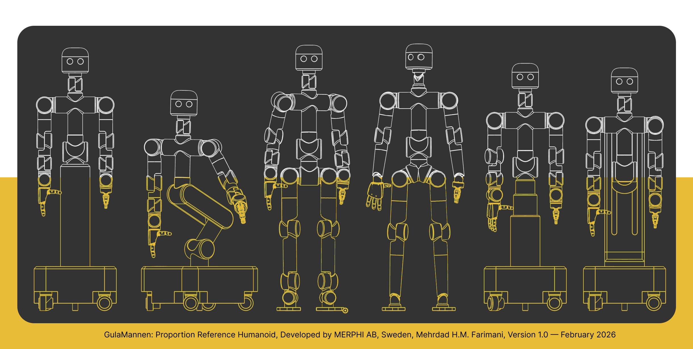

# gulamannen-reference-humanoids

GulaMannen is a modular humanoid reference platform developed to support simulation-first morphology exploration.  
It provides a structured set of humanoid configurations that allow robotics teams to evaluate proportions, joint architectures, and workspace compatibility before committing to a custom mechanical design.

The platform is intended as a reusable baseline for research, prototyping, and early-stage humanoid development.

Link to Onshape file: [Onshape] (https://cad.onshape.com/documents/501ce9a5619591c04ff8e40c/w/2dc6661522066c4232336a9b/e/3683eb6198817770f1f8b17c)
---

## Overview

Humanoid projects frequently begin with proportions derived from human anatomy references. Later, when control constraints, simulation feedback, or task requirements are introduced, geometry often needs revision. This creates iteration overhead and misalignment between mechanical, controls, and AI teams.

GulaMannen addresses this by providing:

- Six reference humanoid configurations
- Modular subsystem architecture
- Interchangeable joint types
- Multiple base configurations
- Reference task environments for evaluation
- Public CAD source (Onshape)
- URDF packages for simulation

The goal is to enable early, structured evaluation of morphology decisions.

---

## Reference Configuration (Config 1 – Series Biped)

This configuration serves as the canonical baseline of the platform.

### General Specifications

- Height: 900-1800 mm  
- Approximate Mass: 62 kg (simulation-level estimate)  
- Total DoFs: 30  
- Foot Size: 280 × 110 mm  
- Units: millimeters  
- Coordinate System: Z-up  

### Degrees of Freedom Breakdown

| Subsystem | DoFs |
|-----------|------|
| Neck | 2 |
| Shoulder (per arm) | 3 |
| Elbow (per arm) | 1 |
| Wrist (per arm) | 3 |
| Torso | 2 |
| Hip (per leg) | 3 |
| Knee (per leg) | 1 |
| Ankle (per leg) | 2 |

Hip architecture is PRY-based and available in both horizontal and 25° angled variants.

Wrist and ankle architectures support both serial and parallel joint configurations.

---

## Included Configurations

Six reference configurations are provided:

### 1. Series Biped Humanoid
Fully articulated biped with serial actuator placement.  
Serves as the primary morphology baseline.

**Use cases**
- Whole-body control research  
- Locomotion studies  
- Baseline comparison  

---

### 2. Parallel Wrist and Ankle Biped
Biped configuration with intersecting rotational axes at wrist and ankle.

**Use cases**
- Compact joint packaging studies  
- Alternative kinematic evaluation  

---

### 3. Pedestal-Mounted Hybrid
Upper body mounted on fixed-height pedestal.

**Use cases**
- Manipulation research  
- Workstation evaluation  
- Upper-body development  

---

### 4. Vertical Linear Actuator Hybrid
Upper body mounted on vertically adjustable column.

**Use cases**
- Shelf interaction studies  
- Variable height workspace analysis  

---

### 5. Single-Leg Hybrid (3-DoFLower Body)
Minimal lower-body architecture with positioning capability.

**Use cases**
- Reduced-complexity platforms  
- Manipulation-focused development  

---

### 6. Linear Rail Tower Configuration
Upper body mounted on vertical rail elevator system.

**Use cases**
- Structured indoor environments  
- Vertical service scenarios  
- Fixed footprint deployments  

---

## Modularity

The platform supports subsystem-level interchangeability.

Swappable components include:

- Wrist architecture (serial / parallel)
- Ankle architecture
- Hip configuration (horizontal / angled)
- Neck type
- Base configuration:
  - Full biped
  - Pedestal
  - Vertical linear actuator
  - Rail tower
  - Mobile base variants

The upper body architecture is shared across configurations.

Future releases will expand continuous parametric length control.

---

## Actuator Reference Classes

The platform uses three placeholder actuator classes inspired by commercially available QDD harmonic drive actuators.

These are intended for simulation-level exploration and can be replaced with real actuator parameters.

| Class | Peak Torque (approx.) | Mass (approx.) | Typical Usage |
|-------|-----------------------|---------------|---------------|
| Small | 40 Nm | 0.8 kg | Wrist, neck |
| Medium | 120 Nm | 1.9 kg | Elbow, ankle |
| Large | 280 Nm | 3.8 kg | Hip, knee, shoulder |

Actuator parameters should be refined for production-level analysis.

---

## Simulation Compatibility

URDF packages are provided for several configurations.

| Simulator | Status |
|------------|--------|
| Isaac Sim | Fully validated |
| Mujoco | Compatible (community validation encouraged) |
| Gazebo | Compatible (community validation encouraged) |
| PyBullet | Compatible (community validation encouraged) |
| Webots | Compatible (community validation encouraged) |

### URDF Completeness

- Visual meshes: included  
- Joint structure: included  
- Inertial properties: partial  
- Collision meshes: optimized  

Users are encouraged to improve inertial modeling and dynamics.

---

## CAD Source (Onshape)

The source of truth for all CAD models is maintained in Onshape.

Public documents are available and can be copied into private workspaces.

### Typical Workflow

1. Open public Onshape document  
2. Copy document to your workspace  
3. Modify or export assemblies  
4. Export meshes or URDF  
5. Import into simulation  

Onshape supports integration with Isaac Sim export workflows.

See `/onshape` for document links and export guidance.
https://cad.onshape.com/documents/501ce9a5619591c04ff8e40c/w/2dc6661522066c4232336a9b/e/cecf540cbb7ffca20b4bfecd?renderMode=0&uiState=69a1c73a0e33d4e9b646d3da
---

## Reference Scenarios

Standardized task environments are provided to evaluate morphology decisions.

Included:

- Desk and workstation layouts  
- Industrial pallet and box dimensions  
- Shelf configurations  
- Reach and clearance evaluation structures  

These environments allow comparison of configurations under consistent task constraints.

---

## Intended Use

GulaMannen is intended for:

- Morphology exploration  
- Simulation-first humanoid design  
- Workspace compatibility analysis  
- Early-stage platform development  
- Research and prototyping  

It is not a production-ready mechanical design without further engineering validation.

---

## Project Status

**Version:** 1.0  
**Release Date:** February 2026  

### Included in v1.0

- Six reference configurations  
- Modular architecture framework  
- Public Onshape CAD  
- Partial URDF packages  
- Reference scenario assets  

### Planned

- Improved inertial modeling  
- Expanded URDF coverage  
- Additional modular components  
- Community validation across simulators  

---

## Contributing

Contributions are welcome:

- New configurations  
- Improved URDF models  
- Simulation validation results  
- Scenario extensions  

Please see `CONTRIBUTING.md`.

---

## Attribution

GulaMannen: Proportion Reference Humanoid  
Developed by MERPHI AB, Sweden.

Lead designer:  
Mehrdad Hossein Morvaridi Farimani  

Version 1.0 — February 2026

If used in research or development, attribution to the project and MERPHI AB, Mehrdad Farimani. is requested.  
See `CITATION.cff`.

---

## License

See `LICENSE` file for licensing terms.
